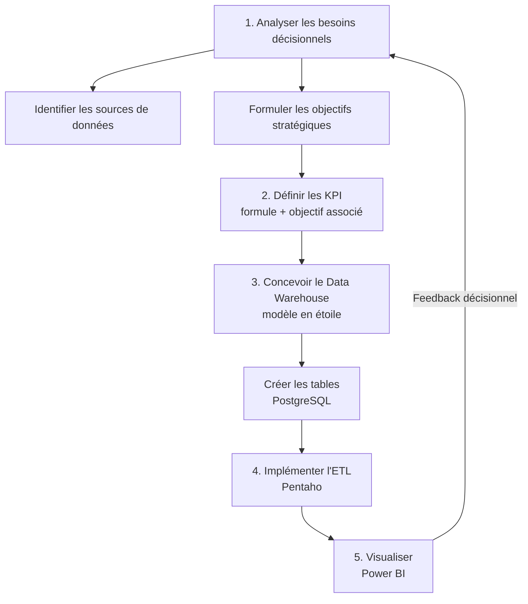
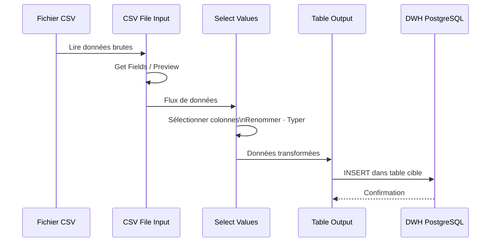

#  Business Intelligence — Cours Complet

**Enseignant :** Transcriptions vidéo du cours  
**Niveau :** 2A CI Genie Informatique  
**Outil principal :** PostgreSQL · Pentaho · Power BI

---

##  Objectifs généraux

1. Comprendre la finalité et les composants d'un système décisionnel (BI)
2. Maîtriser la modélisation d'un Data Warehouse (schéma en étoile)
3. Implémenter un processus ETL avec Pentaho
4. Construire des tableaux de bord analytiques avec Power BI

##  Plan du cours

|N°|Chapitre|TP associé|
|---|---|---|
|1|Introduction à la Business Intelligence|—|
|2|Donnée → Information → Connaissance → Décision|—|
|3|Architecture d'un système BI|—|
|4|Modélisation du Data Warehouse|⚙️ TP1 · TP2|
|5|Analyse des besoins décisionnels & KPI|⚙️ TP1|
|6|ETL avec Pentaho|⚙️ TP3 · TP4|
|7|Visualisation avec Power BI|⚙️ TP4 · TP5|

##  Prérequis

- Bases de données relationnelles (SQL : SELECT, JOIN, GROUP BY, agrégats)
- Notions de modélisation (MCD, MLD)
- Environnement PostgreSQL installé — Java 21 (pour Pentaho)

---

## Chapitre 1 — Introduction à la Business Intelligence

**Objectifs :** Définir le BI · Identifier ses utilisateurs · Comprendre la problématique des données dispersées  
**Mots-clés :** Business Intelligence · Systèmes décisionnels · Décideurs · Données hétérogènes · Data Warehouse

###  Résumé narratif

La **Business Intelligence** (BI), traduite en français par **systèmes décisionnels**, désigne l'ensemble des méthodes, processus, technologies et outils permettant de transformer des données brutes d'entreprise en informations exploitables pour la prise de décision stratégique. Les utilisateurs finaux de ces systèmes ne sont pas les techniciens ou les développeurs, mais les **décideurs** : directeurs, managers, chefs de service. La problématique fondatrice du BI est la dispersion des données dans les entreprises : données réparties sur plusieurs systèmes (ERP, CRM, Excel, bases de données), dans des formats hétérogènes (structurés, semi-structurés, fichiers log), rendant toute vision globale et cohérente quasiment impossible sans un système centralisé.

### ✅ Points clés

- Le BI est un **système d'aide à la décision** : il fournit des analyses, les décisions restent humaines.
- Les utilisateurs sont les **décideurs** (managers, directeurs) — non les ingénieurs ou opérateurs.
- Les données d'entreprise sont **dispersées** sur plusieurs systèmes et **hétérogènes** (formats variés).
- La méthode classique (rapports par service) génère des **incohérences** et une **vision fragmentée**.
- Le BI centralise les données dans un **Data Warehouse** pour permettre une vision globale.
- Le BI est une discipline mature (antérieure à l'IA) qui intègre désormais l'IA pour enrichir les analyses.
- L'objectif final : **améliorer la qualité des décisions**, accélérer l'analyse, optimiser les performances.

###  Carte mentale

![[Pasted image 20260504204604.png]]

### ⚙️ Processus : du problème à la solution BI

![[Entreprise Multi-systèmes (2).png]]

### 📌 Exemple d'ancrage

**Contexte :** Un directeur d'une chaîne hôtelière souhaite connaître le chiffre d'affaires global.  
**Sans BI :** Il doit interroger manuellement le système de réservation, le CRM, la comptabilité — données incohérentes, délai long.  
**Avec BI :** Toutes les données sont centralisées dans un Data Warehouse ; une requête unique retourne le chiffre d'affaires consolidé en quelques secondes.

↔ **Lien avec Chapitre 3** : Les composants BI (ETL, DWH, OLAP) sont la réponse technique à ces problèmes.  
📌 **Prérequis de Chapitre 4** : Comprendre pourquoi on centralise les données justifie la conception du DWH.

---

## Chapitre 2 — Donnée → Information → Connaissance → Décision

**Objectifs :** Distinguer les 4 niveaux sémantiques · Comprendre la chaîne de valeur analytique  
**Mots-clés :** Donnée brute · Information · Connaissance · Décision · Contextualisation · Analyse approfondie

### 📝 Résumé narratif

Un système décisionnel repose sur une chaîne de valeur sémantique à quatre niveaux. Une **donnée** est un élément brut, non interprété — une valeur numérique ou textuelle sans contexte. Dès qu'on lui attribue un contexte (date, produit, région), elle devient une **information** : quelque chose de compréhensible. Lorsqu'on soumet plusieurs informations à des calculs et analyses approfondies (agrégations, comparaisons, tendances), on produit une **connaissance** — une assertion significative sur l'activité. C'est cette connaissance qui permet de formuler une **décision** stratégique. La décision n'est pas automatique : elle reste l'acte du décideur, éclairé par les analyses du système. Le BI minimise le risque d'erreur sans l'éliminer.

### ✅ Points clés

- **Donnée** = élément brut, non interprété (ex. : `2500`, `Casablanca`, `2025-01-15`).
- **Information** = donnée contextualisée (ex. : _2 500 ventes en janvier 2025_).
- **Connaissance** = résultat d'une analyse approfondie (ex. : _Casablanca génère 40 % du CA_).
- **Décision** = action stratégique fondée sur la connaissance (ex. : _Investir davantage à Casablanca_).
- Une décision prise via le BI minimise l'erreur sans la garantir à zéro.
- La décision est évaluée après exécution → cycle d'amélioration continue.

### 🗺️ Carte mentale

![[Chaîne de Valeur des Données.png]]


### 📊 Tableau comparatif

|Niveau|Définition|Exemple concret|Opération BI|
|---|---|---|---|
|**Donnée**|Élément brut, non interprété|`2500`|Collecte / stockage|
|**Information**|Donnée mise en contexte|_2500 ventes en jan._|Structuration / requête|
|**Connaissance**|Résultat d'analyse approfondie|_Casablanca = 40 % du CA_|SUM, AVG, GROUP BY|
|**Décision**|Action stratégique basée sur la connaissance|_Lancer une campagne marketing_|Tableau de bord / rapport|

### 📌 Exemple d'ancrage

**Contexte :** Base de données e-commerce.  
**Donnée :** Enregistrement `{produit_id: 42, quantité: 15, date: 2025-03-10}`.  
**Information :** _15 unités du Produit 42 vendues le 10 mars 2025._  
**Connaissance :** _Le Produit 42 est 3× plus vendu pendant les promotions (analyse sur 12 mois)._  
**Décision :** _Planifier une promotion mensuelle pour le Produit 42._

↔ **Lien avec Chapitre 5** : Les KPI sont des indicateurs de connaissance calculés automatiquement.  
📌 **Prérequis de Chapitre 7** : Les visualisations Power BI représentent des informations et connaissances.

---

## Chapitre 3 — Architecture d'un système BI

**Objectifs :** Identifier les composants techniques d'un BI · Comprendre leurs rôles et interactions  
**Mots-clés :** ETL · Data Warehouse · OLAP · Tableau de bord · Sources opérationnelles · Intégration de données

### 📝 Résumé narratif

Un système BI est structuré en quatre couches fonctionnelles interdépendantes. La **couche source** regroupe les systèmes opérationnels existants de l'entreprise (bases transactionnelles, CRM, ERP, fichiers CSV/Excel). La couche **ETL** (Extract – Transform – Load) extrait les données de ces sources, les nettoie, les transforme et les charge dans l'entrepôt. Le **Data Warehouse** (DWH) est la base de données centrale, conçue spécifiquement pour l'analyse et non pour les transactions ; elle stocke un historique consolidé selon un modèle multidimensionnel. La couche **OLAP** (Online Analytical Processing) permet des analyses multidimensionnelles sur le DWH. Enfin, la couche **présentation** expose les résultats via des tableaux de bord et rapports interactifs (Power BI, Tableau, etc.).

### ✅ Points clés

- **ETL** = cœur technique du BI ; processus en trois étapes : Extraire → Transformer → Charger.
- **Data Warehouse** ≠ base de données transactionnelle : optimisé pour la lecture et l'analyse (OLAP).
- Le DWH ne crée pas de nouvelles données : il centralise et structure celles qui existent.
- **OLAP** = requêtes analytiques intensives (SELECT + agrégats + GROUP BY).
- Les **tableaux de bord** sont la couche visible pour le décideur.
- Les données du DWH représentent un **historique** (passé analysé pour décider l'avenir).

### 🗺️ Architecture globale

![[Flux d'Architecture de Données.png]]

### 📊 Tableau comparatif : Base transactionnelle vs Data Warehouse

|Critère|Base transactionnelle (OLTP)|Data Warehouse (OLAP)|
|---|---|---|
|**Objectif**|Gérer les opérations quotidiennes|Analyser l'historique|
|**Opérations**|INSERT, UPDATE, DELETE|SELECT, agrégats|
|**Volume**|Données récentes|Historique complet|
|**Modèle**|Normalisé (3NF)|Dénormalisé (étoile/flocon)|
|**Utilisateurs**|Techniciens, applications|Décideurs, analystes|
|**Exemple**|CRM, ERP, e-commerce|DWH hôtellerie|

↔ **Lien avec Chapitre 6** : Pentaho est l'outil ETL utilisé en TP.  
↔ **Lien avec Chapitre 7** : Power BI connecte la couche présentation au DWH.

---

## Chapitre 4 — Modélisation du Data Warehouse ⚙️ TP1 · TP2

**Objectifs :** Concevoir un schéma en étoile · Identifier table de faits et dimensions · Modéliser des hiérarchies  
**Mots-clés :** Schéma en étoile · Table de faits · Table de dimension · Clé étrangère · Mesure · Hiérarchie · Analyse multidimensionnelle

### 📝 Résumé narratif

La modélisation d'un Data Warehouse repose sur le **schéma en étoile** (_Star Schema_) : une **table de faits** centrale, entourée de **tables de dimension**. La table de faits contient les mesures quantitatives (montants, quantités, durées) et les clés étrangères vers chaque dimension. Les tables de dimension contiennent les attributs descriptifs permettant d'analyser les faits selon différents axes (temps, client, produit, région). C'est le principe de l'**analyse multidimensionnelle** : on analyse une métrique centrale selon plusieurs contextes simultanément. Les dimensions peuvent être organisées en **hiérarchies** (ex. Jour → Mois → Trimestre → Année) permettant l'exploration à différents niveaux de granularité. La table de faits est généralement la plus volumineuse car un même client, produit ou hôtel génère de nombreuses transactions.

### ✅ Points clés

- **Table de faits** = mesures quantitatives + clés étrangères vers les dimensions.
- **Table de dimension** = attributs descriptifs (contexte des mesures).
- La table de faits est **la plus grande** (une ligne = une transaction).
- Nommage conventionnel : préfixe `fact_` pour les faits, `dim_` pour les dimensions.
- Une **hiérarchie** = niveaux d'agrégation croissants (Jour → Mois → Année).
- Plusieurs tables de faits peuvent partager des dimensions communes (**constellation**).
- On modélise en fonction des **KPI définis** lors de l'analyse des besoins.

### 🗺️ Carte mentale — Modélisation

![[Schéma en étoile.png]]

### ⚙️ Schéma en étoile — Cas hôtellerie

![[base de données réservation.png]]

### 📊 Table de faits vs Table de dimension

|Critère|Table de Faits|Table de Dimension|
|---|---|---|
|**Contenu**|Mesures quantitatives + FK|Attributs descriptifs|
|**Taille**|La plus grande|Plus petite|
|**Préfixe**|`fact_`|`dim_`|
|**Exemple**|`fact_reservation`|`dim_client`, `dim_temps`|
|**Mise à jour**|Très fréquente|Peu fréquente|
|**Rôle**|Ce qu'on mesure|Selon quel axe on mesure|

> **Définition :** Analyse multidimensionnelle → analyser une métrique (ex. chiffre d'affaires) selon plusieurs dimensions simultanément (par temps, par client, par région).

### 📌 Exemple d'ancrage

**Contexte :** Chaîne hôtelière — on veut calculer le CA par hôtel et par mois.  
**Requête analytique :**

```sql
SELECT h.nom_hotel, t.mois, SUM(f.montant_total) AS CA
FROM fact_reservation f
JOIN dim_chambre h ON f.fk_chambre = h.id_chambre
JOIN dim_temps t ON f.fk_temps = t.id_temps
GROUP BY h.nom_hotel, t.mois
ORDER BY t.mois;
```

**Résultat :** Vision du CA par hôtel, mois par mois — en une seule requête grâce au schéma en étoile.

⚙️ **TP1 associé :** Modélisation d'un DWH e-commerce — définir fact_vente + dimensions.  
⚙️ **TP2 associé :** Modélisation du DWH hôtellerie — schéma complet + hiérarchies.

↔ **Lien avec Chapitre 5** : Les KPI définissent quelles mesures placer dans la table de faits.  
📌 **Prérequis de Chapitre 6** : Le schéma doit être créé avant de lancer l'ETL.

---

## Chapitre 5 — Analyse des besoins décisionnels & KPI ⚙️ TP1

**Objectifs :** Structurer une analyse BI · Définir des KPI alignés aux objectifs · Formuler des formules de calcul  
**Mots-clés :** Besoins décisionnels · KPI · Objectif stratégique · Indicateur de performance · Formule de calcul · Sources opérationnelles

### 📝 Résumé narratif

Avant toute implémentation technique, un projet BI exige une phase d'**analyse des besoins décisionnels**, analogue à l'analyse des besoins fonctionnels en développement logiciel classique. Cette phase comporte trois activités : identifier les sources de données et leurs limites, cerner les problèmes décisionnels que rencontre la direction, puis formuler les **objectifs stratégiques** de la solution BI. À partir de ces objectifs, on définit les **KPI** (Key Performance Indicators), chacun associé à un objectif, accompagné d'une formule de calcul. Ces KPI guident directement la conception du Data Warehouse : les mesures de la table de faits correspondent aux valeurs à calculer par ces KPI. Enfin, le modèle conceptuel est traduit en modèle logique (tables SQL), puis implémenté.

### ✅ Points clés

- L'analyse BI précède toujours l'implémentation technique.
- Les **objectifs stratégiques** sont formulés à partir des problèmes identifiés par la direction.
- Chaque **KPI** est lié à un objectif stratégique et possède une formule de calcul.
- Les KPI guident la conception du DWH : ils dictent les mesures de la table de faits.
- La formule peut s'exprimer mathématiquement ou en pseudo-SQL (SUM, AVG, COUNT, GROUP BY).
- Le processus BI suit : **Analyse → Conception DWH → ETL → Visualisation**.

### 🗺️ Carte mentale — Processus de développement BI

![[Analyse des besoins décisionnels.png]]



### 📊 Exemple de KPI — Cas hôtellerie

|KPI|Objectif stratégique|Formule de calcul|
|---|---|---|
|**Chiffre d'affaires total**|Analyser la rentabilité globale|`SUM(montant_total)`|
|**CA par hôtel**|Évaluer performances par région|`SUM(montant_total) GROUP BY hotel`|
|**Taux d'occupation**|Identifier les périodes d'activité|`nb_nuits_réservées / capacité_totale × 100`|
|**Durée moyenne de séjour**|Identifier les périodes d'activité|`AVG(nombre_nuits)`|
|**Revenu moyen par chambre**|Analyser rentabilité par chambre|`SUM(montant_total) / nb_chambres`|
|**CA par canal de réservation**|Optimiser les canaux marketing|`SUM(montant_total) GROUP BY canal`|
|**Nb réservations par pays client**|Analyser la provenance clients|`COUNT(id_reservation) GROUP BY pays_client`|

> **Définition :** KPI (Key Performance Indicator) → indicateur mesurable permettant d'évaluer l'atteinte d'un objectif stratégique.

### 📌 Exemple d'ancrage

**Contexte :** Entreprise e-commerce marocaine.  
**Problème :** Impossible de calculer rapidement le CA global (données réparties sur commandes, CRM, comptabilité).  
**Objectif :** Obtenir le CA global mensuel en temps réel.  
**KPI :** `CA_mensuel = SUM(montant_commande) GROUP BY mois`  
**Impact sur le DWH :** La colonne `montant_commande` doit figurer dans `fact_vente` ; la dimension `dim_temps` doit inclure `mois`.

⚙️ **TP1 associé :** Analyser l'énoncé e-commerce, identifier sources, formuler 5 KPI avec objectifs et formules.

↔ **Lien avec Chapitre 4** : Les KPI déterminent le contenu de la table de faits.  
↔ **Lien avec Chapitre 7** : Chaque visualisation Power BI représente un KPI.

---

## Chapitre 6 — ETL avec Pentaho ⚙️ TP3 · TP4

**Objectifs :** Comprendre le processus ETL · Créer des transformations Pentaho · Implémenter le chargement dans PostgreSQL  
**Mots-clés :** ETL · Pentaho · Extract · Transform · Load · CSV · Select Values · Table Output · Job · Transformation · Docker

### 📝 Résumé narratif

L'**ETL** (Extract – Transform – Load) est le processus central d'alimentation du Data Warehouse. L'extraction consiste à lire des données depuis les sources (fichiers CSV, bases relationnelles, API). La transformation applique des opérations de nettoyage et de normalisation : sélection de colonnes, renommage, conversion de types, suppression de doublons, calculs dérivés. Le chargement insère les données transformées dans les tables cibles du DWH. **Pentaho Data Integration** (PDI, aussi appelé Kettle) est l'outil open-source utilisé en TP. Il s'organise en **Transformations** (flux de données avec étapes connectées) et en **Jobs** (orchestration de plusieurs transformations). Chaque étape est connectée visuellement ; l'exécution d'une transformation peut être testée via un preview avant chargement final dans PostgreSQL.

### ✅ Points clés

- **ETL** = Extract (lire source) → Transform (nettoyer/convertir) → Load (charger dans DWH).
- **Pentaho** fonctionne avec Java 21 — lancé via `Spoon.bat` (Windows) ou `spoon.sh` (Linux/Mac).
- Une **Transformation** = flux de données composé d'étapes (steps) connectées visuellement.
- Un **Job** = séquence ordonnée de transformations (orchestration globale).
- **Select Values** : sélectionner colonnes, renommer, changer type, supprimer colonnes inutiles.
- **Table Output** : charger les données dans une table PostgreSQL cible.
- Les tables de dimension doivent être chargées **avant** la table de faits (contraintes FK).
- La connexion PostgreSQL doit être créée et testée avant toute transformation.

### 🗺️ Carte mentale — Pentaho

![[Pentaho ETL.png]]
### ⚙️ Processus ETL complet dans Pentaho



### 📊 Types de transformations Pentaho

|Step|Rôle|Paramètres clés|
|---|---|---|
|**CSV File Input**|Extraire depuis un fichier CSV|Chemin fichier · Délimiteur · Get Fields|
|**Select Values**|Sélectionner · Renommer · Typer colonnes|Select & Alter · Remove · Meta-data|
|**Table Output**|Charger dans PostgreSQL|Connexion · Nom de table|
|**Sort Rows**|Trier les données|Colonnes de tri|
|**Filter Rows**|Filtrer selon condition|Expression booléenne|
|**String Operations**|Nettoyer chaînes|Trim · Upper · Lower|

### 📌 Exemple d'ancrage

**Contexte :** Charger `dim_client` depuis `client.csv` vers PostgreSQL.  
**Étape 1 — Extract :** `CSV File Input` → sélectionner `client.csv` → `Get Fields` → preview OK.  
**Étape 2 — Transform :** `Select Values` → supprimer colonne `nom` si non requise → typer `id_client` en Integer.  
**Étape 3 — Load :** `Table Output` → connexion `hotel_dwh` → table `dim_client` → Run.

> **⚠️ Point de vigilance :** Toujours créer les tables dans PostgreSQL (TP3) **avant** d'exécuter les transformations Pentaho (TP4).

⚙️ **TP3 associé :** Créer la base `hotel_dwh` via Docker + PostgreSQL, créer toutes les tables (dimensions + fait).  
⚙️ **TP4 associé :** Créer une transformation Pentaho par dimension + une pour la table de faits, assembler en Job.

↔ **Lien avec Chapitre 4** : Le schéma en étoile est la cible du chargement ETL.  
📌 **Prérequis de Chapitre 7** : Le DWH doit être alimenté avant de connecter Power BI.

---

## Chapitre 7 — Visualisation avec Power BI ⚙️ TP4 · TP5

**Objectifs :** Connecter Power BI au DWH · Créer des visualisations KPI · Construire un tableau de bord interactif  
**Mots-clés :** Power BI · Dashboard · Tableau de bord · Graphique à barres · Histogramme · Carte géographique · Visualisation · DAX implicite

### 📝 Résumé narratif

Power BI est l'outil de visualisation BI utilisé pour construire les tableaux de bord interactifs. Il se connecte directement au Data Warehouse PostgreSQL (ou importe des fichiers CSV pour les TP). Une fois les données chargées, Power BI établit automatiquement les relations entre tables via les clés (relations dim/fact). L'utilisateur crée des **visualisations** en glissant-déposant les champs du modèle : Power BI génère implicitement les requêtes d'agrégation (GROUP BY, SUM, COUNT) sans écriture SQL manuelle. Chaque visualisation représente un ou plusieurs KPI. Le tableau de bord final (dashboard) regroupe toutes les visualisations sur une ou plusieurs pages, permettant une lecture synthétique et interactive de l'activité pour le décideur.

### ✅ Points clés

- Power BI génère des requêtes **DAX implicites** (GROUP BY + agrégat) par glisser-déposer.
- Les relations entre tables (dim/fact) sont détectées **automatiquement** par Power BI.
- Chaque visualisation = un KPI → lier chaque graphique à un objectif stratégique.
- La **carte géographique** nécessite d'activer les visuels dans Fichier → Options → Sécurité.
- La taille des bulles sur une carte = une mesure quantitative (ex. nombre de réservations).
- On peut filtrer, trier, et explorer par hiérarchie (ex. date → mois → jour).
- Il faut redémarrer Power BI après modification des paramètres de sécurité.

### 🗺️ Carte mentale — Power BI

![[Power BI Dashboard.png]]

### ⚙️ Workflow Power BI

![[Projet Power BI.png]]

### 📊 Types de graphiques Power BI — Guide de choix

|KPI à afficher|Type recommandé|Axe X|Axe Y / Valeur|
|---|---|---|---|
|Évolution CA dans le temps|Courbe / Aire|Mois/Année|SUM(montant_total)|
|CA par hôtel (comparaison)|Barres empilées horizontal|nom_hotel|SUM(montant_total)|
|Réservations par canal|Camembert / Anneau|nom_canal|COUNT(id_reservation)|
|Clients par pays d'origine|Carte géographique|pays_client|COUNT(id_reservation)|
|Réservations par ville hôtel|Histogramme|ville_hotel|SUM ou COUNT|
|CA par trimestre|Barres groupées|trimestre|SUM(montant_total)|

### 📌 Exemple d'ancrage

**Contexte :** Créer la visualisation "Nombre de réservations par canal".

1. Insérer un graphique à secteurs.
2. Glisser `dim_canal.nom_canal` → champ **Axe**.
3. Glisser `fact_reservation.id_reservation` → champ **Valeur** → sélectionner **Nombre (Count)**.
4. Power BI génère implicitement : `SELECT nom_canal, COUNT(id_reservation) FROM … GROUP BY nom_canal`.  
    **Résultat :** Camembert montrant la répartition : Site web · App mobile · Agence · Téléphone.

> **⚠️ Point de vigilance — Carte géographique :** Fichier → Options et paramètres → Options → Sécurité → cocher les visuels → Ctrl+S → Fermer Power BI → Rouvrir.

⚙️ **TP4/5 associé :** Créer un tableau de bord complet avec 6 visualisations sur le DWH hôtellerie.

↔ **Lien avec Chapitre 5** : Chaque visualisation correspond à un KPI défini en phase d'analyse.  
↔ **Lien avec Chapitre 2** : Les graphiques représentent le niveau **Information** et **Connaissance**.

---

## 📚 Tableau des concepts fondamentaux

|Concept|Définition|Contexte d'utilisation|Chapitre|TP|
|---|---|---|---|---|
|**Business Intelligence**|Ensemble méthodes/outils pour transformer données brutes en décisions|Tout projet décisionnel|Ch.1|—|
|**Système décisionnel**|Traduction française de BI ; système d'aide à la décision|Entreprise multi-sources|Ch.1|—|
|**Donnée**|Élément brut, non interprété|Source (CSV, BD)|Ch.2|—|
|**Information**|Donnée contextualisée et compréhensible|Requête avec contexte|Ch.2|—|
|**Connaissance**|Résultat d'une analyse approfondie (calculs, agrégats)|KPI, rapports|Ch.2|TP1|
|**Décision**|Action stratégique fondée sur la connaissance|Usage du dashboard|Ch.2|—|
|**Data Warehouse**|Base de données centrale dédiée à l'analyse historique|Stockage DWH|Ch.3|TP3|
|**ETL**|Processus Extract-Transform-Load d'alimentation du DWH|Intégration données|Ch.3, 6|TP3, TP4|
|**OLAP**|Traitement analytique en ligne ; requêtes SELECT/agrégats|Analyse multidim.|Ch.3|—|
|**Schéma en étoile**|Modèle DWH : table de faits centrale + dimensions périphériques|Conception DWH|Ch.4|TP2|
|**Table de faits**|Table centrale : mesures quantitatives + clés étrangères|Modélisation|Ch.4|TP2|
|**Table de dimension**|Table contextuelle : attributs descriptifs|Modélisation|Ch.4|TP2|
|**Hiérarchie**|Niveaux d'agrégation d'une dimension (ex. Jour→Mois→An)|Drill-down|Ch.4|TP2|
|**KPI**|Indicateur de performance aligné à un objectif stratégique|Analyse besoins|Ch.5|TP1|
|**Transformation Pentaho**|Flux ETL visuel : steps connectés pour traiter les données|ETL|Ch.6|TP4|
|**Job Pentaho**|Orchestration d'un ensemble de transformations|ETL complet|Ch.6|TP4|
|**Select Values**|Step Pentaho : sélection, renommage, typage de colonnes|ETL Transform|Ch.6|TP4|
|**Table Output**|Step Pentaho : chargement vers table PostgreSQL|ETL Load|Ch.6|TP4|
|**Dashboard**|Tableau de bord interactif regroupant les visualisations KPI|Power BI|Ch.7|TP5|
|**DAX implicite**|Requête d'agrégation auto-générée par Power BI|Visualisation|Ch.7|TP5|

---

## 📖 Glossaire alphabétique

**Agrégation** → Opération SQL calculant une valeur résumée sur un ensemble de lignes (SUM, AVG, COUNT, MAX, MIN). Utilisée pour calculer les KPI.

**Analyse multidimensionnelle** → Analyse d'une métrique centrale selon plusieurs dimensions simultanément. Ex. : CA par produit × par région × par mois.

**BI (Business Intelligence)** → Voir _Systèmes décisionnels_. Ensemble méthodes/outils de transformation données → décisions.

**Canal de réservation** → Axe de dimension indiquant le moyen utilisé pour réserver (site web, app mobile, agence, téléphone).

**CRM** (Customer Relationship Management) → Système de gestion de la relation client ; source de données courante dans un projet BI.

**Dashboard** → Tableau de bord interactif regroupant plusieurs visualisations ; couche de présentation du BI.

**DAX** (Data Analysis Expressions) → Langage de formules Power BI. DAX implicite = formule auto-générée par glisser-déposer.

**Data Warehouse (DWH)** → Entrepôt de données centralisé, optimisé pour l'analyse historique (OLAP). ≠ base transactionnelle.

**Décision** → Action stratégique fondée sur les connaissances extraites du BI. Toujours humaine, jamais automatique.

**dim_** → Préfixe de nommage des tables de dimension dans un DWH. Ex. : `dim_client`, `dim_temps`.

**Donnée** → Élément brut, non interprété. ≠ Information (contextualisée).

**ERP** (Enterprise Resource Planning) → Progiciel de gestion intégrée ; source opérationnelle courante.

**ETL** (Extract, Transform, Load) → Processus d'alimentation du DWH. Extract = lire source ; Transform = nettoyer/convertir ; Load = charger DWH.

**fact_** → Préfixe de nommage de la table de faits dans un DWH. Ex. : `fact_reservation`, `fact_vente`.

**Hiérarchie** → Organisation d'une dimension en niveaux d'agrégation croissants. Ex. : Jour → Mois → Trimestre → Année.

**Information** → Donnée mise en contexte, devenue compréhensible. ≠ Donnée (brute).

**Job (Pentaho)** → Fichier `.kjb` orchestrant plusieurs transformations dans un ordre défini.

**KPI** (Key Performance Indicator) → Indicateur de performance mesurable, aligné à un objectif stratégique. Calculé par SUM, AVG, COUNT, etc.

**OLAP** (Online Analytical Processing) → Mode d'analyse basé sur des requêtes SELECT + agrégats sur un DWH. ≠ OLTP (transactionnel).

**OLTP** (Online Transaction Processing) → Mode transactionnel classique (INSERT, UPDATE, DELETE). ≠ OLAP.

**Pentaho** → Outil ETL open-source (Data Integration). Se lance via `Spoon.bat` / `spoon.sh`. Requiert Java 21.

**Power BI** → Outil Microsoft de visualisation et tableau de bord BI. Se connecte à PostgreSQL ou importe CSV.

**Schéma en étoile** → Modèle DWH : table de faits centrale entourée de tables de dimension. Optimisé pour requêtes analytiques.

**Select Values (Pentaho)** → Step ETL pour sélectionner, renommer, typer ou supprimer des colonnes.

**Systèmes décisionnels** → Traduction française de _Business Intelligence_.

**Table de dimension** → Table DWH contenant les attributs descriptifs (contexte des mesures). ≠ Table de faits.

**Table de faits** → Table DWH centrale contenant les mesures quantitatives + clés étrangères vers les dimensions. La plus volumineuse.

**Table Output (Pentaho)** → Step ETL chargeant les données transformées dans une table PostgreSQL cible.

**Transformation (Pentaho)** → Fichier `.ktr` représentant un flux de traitement de données (steps connectés visuellement).

> **≠ à retenir :**
> 
> - Donnée ≠ Information ≠ Connaissance (niveaux sémantiques distincts)
> - OLTP ≠ OLAP (transactionnel ≠ analytique)
> - Table de faits ≠ Table de dimension (mesures ≠ contexte)
> - Transformation ≠ Job (flux de données ≠ orchestration)

---

## ⚙️ Index des TPs

|N° TP|Intitulé|Chapitres mobilisés|Compétences visées|Notions clés à réviser|
|---|---|---|---|---|
|**TP1**|Analyse des besoins — E-commerce|Ch.1 · Ch.2 · Ch.5|Identifier sources, formuler KPI, définir objectifs stratégiques|Problématique BI · Chaîne donnée→décision · KPI|
|**TP2**|Modélisation DWH — Hôtellerie|Ch.4 · Ch.5|Concevoir schéma en étoile, identifier table de faits et dimensions, modéliser hiérarchies|Schéma étoile · fact/dim · Hiérarchies|
|**TP3**|Implémentation PostgreSQL|Ch.4 · Ch.6|Créer base de données DWH, créer tables SQL (dim + fact), lancer Docker|SQL CREATE TABLE · Clés étrangères · Ordre de création|
|**TP4**|ETL avec Pentaho|Ch.6|Créer transformations ETL (Extract CSV → Transform → Load PostgreSQL), assembler en Job|Pentaho · Select Values · Table Output · Ordre chargement|
|**TP5**|Tableau de bord Power BI|Ch.5 · Ch.7|Connecter Power BI au DWH, créer 6 visualisations KPI, construire dashboard complet|Types graphiques · DAX implicite · Carte géo|